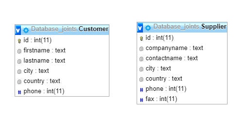

## MySql
This is mySql LEFT RIGHT JOIN WHERE query

## Code
```
SELECT * 
FROM Customer
LEFT JOIN Supplier ON Customer.id_Supplier = Supplier.id
WHERE Customer.firstname =  'Michel'
OR Customer.id IS NULL 
LIMIT 0 , 30
```
## Data tables


## Phpmyadmin


## Output


