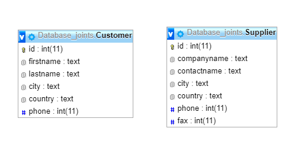
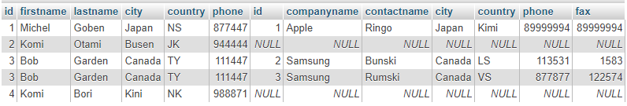
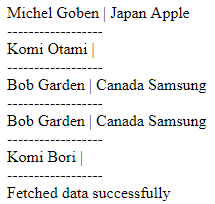

## MySql UNION
This is mySql union query

## Code
```
SELECT * 
FROM Customer AS a
LEFT OUTER JOIN Supplier AS o ON a.city = o.city
UNION 
SELECT * 
FROM Customer AS a
RIGHT OUTER JOIN Supplier AS o ON a.city = o.city
```
## Data tables


## Phpmyadmin

This still have repeating information at id -> 3.

## Output


-firstname-lastname-city-companyname-
